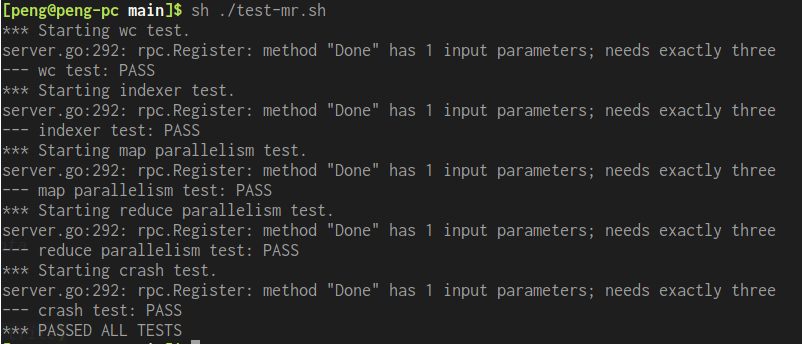

### Lab 1: MapReduce

> https://pdos.csail.mit.edu/6.824/labs/lab-mr.html

#### 简介

本实验的目的是编写一个MapReduce库，作为Go编程以及构建容错分布式系统的入门。MapReduce是Google提出的一种编程模型/算法，用于并行处理大规模数据集。在MapReduce的框架下只需要完成Map函数和Reduce函数而无需考虑其它分布式问题就可以在分布式系统上进行数据处理。MapReduce的运作需要一个Master和多个Worker来完成。

>以wc(单词计数)为例，输入为数个文本文件，目标是获得所有文件中的单词计数。Master可以将整个任务分为M次Map任务和N次Reduce任务来完成。
>
>1. 首先需要产生M个Map任务，每个任务的参数包含一份待处理文件，本Map任务编号m，以及Reduce任务总数。Worker收到任务后，读取文件内容并调用wc任务的`mapFunc(fileName string,content string)[]KeyValue`对任务进行处理。其输出为一个KeyValue键值对的list。对于wc而言，每个键值对的键为文本中出现的单词，而值为出现次数(出现次数始终为1次，也可不填写Value值，而多次出现的单词对应多个KV对)。此后将这个list中的每个键值对，可以根据其key得到n=hash(key)%N，从而将其分为N份(Reduce任务数)，以此将所有键值对写入名为`mr_m_n.txt`的中间文件中。Master等待所有M个Map任务完成后继续Reduce任务。
>2. 上一步的Map任务中我们得到M*N个中间文件，每个中间文件名都包含一个Map任务编号m和Reduce任务编号n。对于编号为n的Reduce任务，它读取属于它的，文件名为`mr_?_n.txt`的M份文件，并将其中所有Key相同的键值对合并为一个`{Key,[]Value}`的形式。将每一组`{Key, []Value}`作为参数调用`reduceFunc(key string, values []string)(result string)` 可以得到该Key对应的处理结果result。由于生成中间文件时同一个Key对应的n是由固定hash函数产生的，所以我们得到的是该Key的全部结果，即所有文件中该单词的出现总次数。将所有`{Key, result}`输出到 `mr_out_n.txt`中。最后将N个Reduce任务结果合并即可得到完整的单词出现次数统计。


#### 实验目的

实现分布式MapReduce，由master和worker两部分构成。master进程只有一个，而worker则是一个或多个并行执行。实际系统中worker在不同的机器上运行，而本lab中它们将在同一台机器上运行。worker通过RPC与master进行通信。每个worker进程会向master请求一个任务，从一个或者多个文件中读取该任务的输入，执行该任务，然后将任务输出写入到一个或者多个文件中。Master需要注意到一个worker没能在合理时间（本lab中为5秒）内完成任务的情况，并将该任务分配给一个不同的worker。

#### lab实现

lab提供了main/mrmaster.go和main/mrworker.go来完成调度任务，而mrapps文件夹内的则是插件形式的map/reduce程序比如wc，我们需要完善mr目录下的master.go,worker.go和rpc.go三个文件，从而让这些插件能够工作。

相比于2018的Lab 1，2020的MapReduce Lab提供了更少的起始代码，自由度更高，但也会让人在一开始有无从下手的感觉。好在实验说明中有提示说：

> One way to get started is to modify mr/worker.go so that Worker() repeatedly sends an RPC to the master asking for a task.

所以我选择从worker.go的Worker()函数来开始完成整个mapReduce lab。

---

##### Worker( )实现

```go
func Worker(mapf func(string, string) []KeyValue,
	reducef func(string, []string) string) {
	// Your worker implementation here.
	// uncomment to send the Example RPC to the master.
	// CallExample()
}
```

Worker函数的输入参数为MapReduce任务所需的mapFunc以及reduceFunc。我们需要在这里实现的是：

- 反复地向Master发送请求任务的RPC

- 如果获取到任务则执行该任务

所以可以将其实现如下：

- 以1s为周期向Master发送RPC请求任务：
  - 如果没有收到任务等待等待1s进行下一次请求。
  - 如果获取到了任务则执行该任务。
  - 如果所有的任务都已经完成了则退出。

```go
func Worker(mapf func(string, string) []KeyValue,
	reducef func(string, []string) string) {
	period := time.Tick(time.Second)
	for range period {
		task := askForTask()
		if task == nil {
			continue
		}
		if task.AllCompleted {
			return
		}
		handleTask(task, mapf, reducef)
	}
}
```

**askForTask()**是封装后的RPC调用。lab中已经实现了RPC注册和调用，并有示例。且由于在所有的部分都在本机运行，使用的通信协议是UnixSocket。

而任务(task)是RPC调用的返回值，作为一个Map任务和Reduce任务通用的结构，其结构如下:	

```go
type Task struct {
	Phase        jobPhase 	//任务阶段，为Map/Reduce选择不同的处理方式
	FileName     string		//Map任务需要的文件名。如果要让一次Map任务处理多个文件可用切片。
	TaskNum      int		//任务编号，Map/Reduce任务都需要一个编号。
	OtherTaskNum int		//另一任务总数，在写入/读取中间文件时需要用到。
	AllCompleted bool		//如果任务已完成，退出Worker
}
```


---

##### Master

为了让Worker能够获取到任务，需要完善Master的相关方法。Lab中提供了一个空的结构体Master，以及与之相关的几个函数/方法。

```go
type Master struct {
	// Your definitions here.
}
func (m *Master) server(){...}
func (m *Master) Done()bool{...}
func MakeMaster(file [], nReduce int) *Master {...}
```

**Master RPC**

至少需要一个RPC来进行任务分配。

```
func (m *Master) HandOutTask(_ *struct{}, reply *Task) error {
	m.mu.Lock()
	defer m.mu.Unlock()
	if m.done {
		reply.AllCompleted = true
		return nil
	}
	task := m.getTask()
	if task != nil {
		*reply = *task
		return nil
	}
	return ErrNoTask
}
```

此外，还需要一个能让Master知道任务已经完成的方式。

可以使用另一个RPC，让Worker在完成任务时能够通知Master该任务已经完成。

也可已将该信息包含在请求任务的过程中，一个worker一次只执行一个任务，如果分配过任务的worker再次请求，那么说明上一次分配给它的任务已经完成了。


**Master需要保存的信息**

而为了完成上述的任务分配等工作，Master至少需要

- 一个任务信息清单
  - 包含任务内容，任务完成情况以及任务最后一次被分配的时间(用于实现超时重新分配)

从而，我们可以实现

- 分配任务:将未分配或超时的任务分配给进行请求的Worker
- 检查任务是否已经完成: m.Done()

我用了一种简单的方式来实现，即用如下TaskInfo结构体的切片

```go
type TaskInfo struct {
	task        *Task		// 任务
	handout     bool		// 是否分配，其实可以用handoutTime==nil来判断
	handoutTime time.Time	// 分配出去的时间
	done        bool		// 是否完成
}
```


**Map/Reduce阶段**

一次完整的MapReduce总是包含Map阶段和Reduce阶段。

可以在MakeMaster时就生成所有的Map任务以及Reduce任务清单。

也可以先创建一个Map任务的清单然后在所有Map任务完成时再创建Reduce任务的清单。

或者只保存必要的任务状态信息，每次被请求时从状态信息取得可分配的任务编号，根据编号, []files，nReduces来创建任务并更新状态。


**Master.Done()**

mrmaster.go 会每隔1秒钟就调用一次该方法来确认任务完成状况。

当所有的任务都完成了(通过Worker的RPC回应得知)就返回true。


---

##### Worker执行任务

在获取到任务信息之后，Worker需要执行该任务。

使用Worker函数的传入参数 mapF 和reduceF来执行一个Map/Reduce任务。


**doMap**

mapF的函数签名为`mapF(fileName string,content string)[]KeyValue`

所以我们读取任务指定的文件，将文件名和文件内容传入mapF函数，得到一个 []KeyValue 切片。

```go
	file := task.FileName
	content, err := ioutil.ReadFile(file)
	if err != nil {
		panic(fmt.Sprintf("read file error:%v", err))
	}
	kvs := mapF(file, string(content))
```

之后只需要根据 n=hash(key) % nReduce，将这些键值对使用json编码分别写入到不同的文件中去。

文件名使用 **mr_m_n**的形式，其中m为本次map任务的任务编号。

> 例如:
>
> ​	Key = "A" 
>
> ​	m = taskNum = 4
>
> ​	n = hash(Key) % nReduce = 3
>
> 那么将所有Key="A"的写入到 mr_4_3的文件中
>
> 所有的Map任务完成后，Key="A"的所有值将分布在 mr_x_3中，然后编号为3的Reduce任务会读取所有这些文件，从而得到Key="A"的所有KeyValue对


**doReduce**

doReduce的任务则是读取上述Map任务产生的对应中间文件，从中读取KeyValue对,将所有相同Key合并到一起，得到{Key, []Values }。然后交给reduceF处理然后写入到输出文件中去。

读取并获得所有的{Key, []Values}

```
	data := make(map[string][]string)

	for i := 0; i < mapTotal; i++ {
		fileName := intermediateName(i, reduceNum)
		file, err := os.Open(fileName)
		if err != nil {
			panic(fmt.Sprintf("opening file %v error:%v", fileName, err))
		}
		decoder := json.NewDecoder(file)
		for {
			kv := new(KeyValue)
			err = decoder.Decode(kv)
			if err != nil {
				break
			}
			data[kv.Key] = append(data[kv.Key], kv.Value)
		}
		file.Close()
	}
```

调用reduceF并写入到输出文件 mr_out_reduceNum

```go
for key := range data {
	value := reduceF(key, data[key])
	outFile.WriteString(fmt.Sprintf("%v %v\n", key, value))
}
```


#### 并发问题

**任务分配**

在Master分配任务时，应当对共享的资源(剩余任务列表)加锁来避免一次将一个任务分配给多个Worker执行的情况。

**文件写入**

如果一个任务被分发出去超过5秒钟还没有完成，那么Master将认为此次任务执行超时，从而将其再次分配给另一个Worker执行。但是之前的Worker可能并没有失败而仅仅是执行得比较慢，这样就会造成它们同时写入同一个文件的问题。

MapReduce论文中提到的方案是使用GFS的 ”原子重命名“操作。在写入文件的过程中使用临时文件名，而在文件写入完成之后再进行重命名操作。这样的话，在任意时刻观察到的拥有合法名称的任务输出文件都是完整的。

Linux中的文件重命名也是原子的，所以应该可以使用同样的方法。不过我在使用的时候遇到了一些问题，所以最后没有使用重命名而是使用了flock来通过测试。


#### 总结



MapReduce算是这一系列lab中比较简单的。几乎没有什么并发上的问题，Worker没有状态，只需要注意对Master临界资源加锁即可。-另外就是需要避免对一个文件的同时写入。

